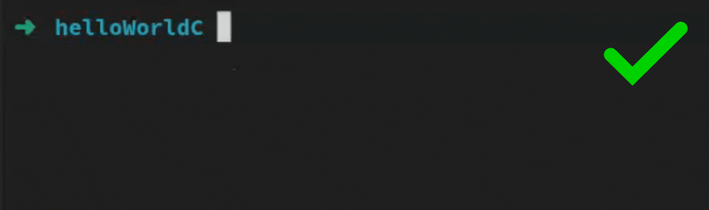

# CExec

A command-line tool to compile and run C/C++ files with a single command.

[🇧🇷 Portuguese Version (Versão em Português)](README.pt-br.md)

## About

CExec is a lightweight GO tool crafted to streamline the compilation and execution of C/C++ programs. With just one terminal command, it automates the entire process, making it effortless for developers to test and run their code. Designed for efficiency, CExec simplifies workflows by combining both steps into a single, intuitive action.

## Traditional Approach vs CExec

### Traditional Approach

The traditional way requires multiple commands to compile and then run C/C++ programs:


### CExec Approach

With CExec, the entire process is simplified into a single command:



## ✨ Watch Mode: Real-time Continuous Development! ✨

**Boost your productivity with the powerful Watch Mode!** 🚀

CExec's Watch Mode completely transforms your C/C++ development experience. With it enabled, you can:

- **Forget repetitive commands** - while you write code, CExec watches your changes and automatically recompiles.
- **See results instantly** - every time you save a file, your code is recompiled and run immediately.
- **Focus on what really matters: your code** - no more switching between editor and terminal!

It's like having a programming assistant that runs your code whenever you make a change. Perfect for:

- Iterative and incremental development
- Learning C/C++
- Quick debugging
- Instant testing of small changes

### How to use:

```bash
CExec -watch=true my_program.cpp
```

That's it! Now you can edit your file with peace of mind - with each save, CExec will automatically recompile and run your program, displaying the results in the terminal.

## Prerequisites

- Go (to build from source)
- A C/C++ compiler (such as g++)

## Installation

### From source

1. Clone this repository
2. Compile the program:

```bash
go build -o build/CExec src/main.go
```

3. Add the compiled executable to your PATH for global usage (optional)

## Usage

### Basic usage

```bash
CExec file.(c/cpp)
```

The program will:

1. Compile the specified C/C++ file using the configured compiler
2. Run the resulting program (if configured)
3. Display the program output

### Command-line options

You can also use command-line flags to customize CExec's behavior:

```bash
CExec -compiler=/path/to/g++ -args="-Wall,-std=c++17" -output=my_program -run=true -source=main.cpp -watch=true
```

| Flag        | Description                                          | Default                            |
| ----------- | ---------------------------------------------------- | ---------------------------------- |
| `-compiler` | Path to the compiler                                 | From config file or required       |
| `-args`     | Compiler arguments (comma-separated)                 | From config file or none           |
| `-output`   | Name of the output executable                        | "output" or "output.exe" (Windows) |
| `-run`      | Whether to run the program after compilation         | From config file or false          |
| `-run-cmd`  | Custom arguments to pass to the program when running | From config file or none           |
| `-source`   | Source file to compile                               | From config file or required       |
| `-watch`    | Enable file watching mode to recompile on changes    | From config file or false          |

## 🔧 Configuring CExec

CExec offers **two flexible configuration methods**:

### 1️⃣ JSON Configuration File

You can create a `CExecConfig.json` file in your working directory for permanent configurations:

```json
{
  "compilerPath": "/usr/bin/g++",
  "compilerArgs": ["-Wall", "-std=c++17"],
  "outputName": "my_program",
  "runAfterCompile": true,
  "customRunCommand": "arg1 arg2",
  "sourceFile": "main.cpp",
  "watchChanges": false
}
```

### 2️⃣ Command-line Flags

For quick usage or to override JSON file configurations, use command-line flags:

```bash
CExec -compiler=/path/to/g++ -args="-Wall,-std=c++17" -output=my_program -run=true -source=main.cpp -watch=true
```

### Configuration Priority

CExec follows a clear order to determine which configuration to use:

1. **Command-line flags** (highest priority) - override any other configuration
2. **CExecConfig.json file** (medium priority) - used when flags are not present
3. **Default values** (lowest priority) - used when no other configuration is provided

This allows you to have a configuration file for your default values, while maintaining flexibility for quick overrides via command line when needed.

### Configuration options:

| Option                | Description                                       | Related Flag | JSON Config        | Required                                          |
| --------------------- | ------------------------------------------------- | ------------ | ------------------ | ------------------------------------------------- |
| Compiler path         | Path to the compiler (e.g., g++)                  | `-compiler`  | `compilerPath`     | Yes                                               |
| Compiler arguments    | List of arguments for the compiler                | `-args`      | `compilerArgs`     | No                                                |
| Executable name       | Name of the generated executable file             | `-output`    | `outputName`       | No (default: "output" or "output.exe" on Windows) |
| Run after compilation | Whether to execute the program after compilation  | `-run`       | `runAfterCompile`  | No (default: false)                               |
| Run arguments         | Arguments to pass to the program during execution | `-run-cmd`   | `customRunCommand` | No                                                |
| Source file           | Source file to be compiled                        | `-source`    | `sourceFile`       | No (can be specified as first argument)           |
| Watch mode            | Enable file watching mode to recompile on changes | `-watch`     | `watchChanges`     | No (default: false)                               |

## Example

```bash
$ CExec my_program.cpp
```

If the program `my_program.cpp` contains:

```cpp
#include <iostream>

int main() {
    std::cout << "Hello, world!" << std::endl;
    return 0;
}
```

The output will be:

```
Hello, world!
```

### Watch mode example

```bash
$ CExec -watch=true my_program.cpp
```

This will start CExec in watch mode. It will compile the file, and then continue monitoring it for changes. Whenever the file is modified and saved, CExec will automatically recompile it.

## Compatibility notes

The executable automatically detects the operating system and adjusts the output file name:

- On Linux/Unix systems: `output`
- On Windows systems: `output.exe`

## Contributions

Contributions are welcome! Feel free to open issues or submit pull requests.
