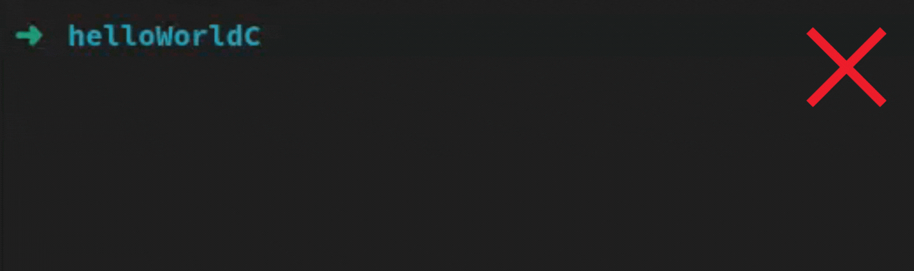
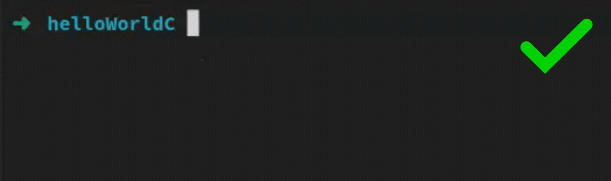

# CExec

Uma ferramenta de linha de comando para compilar e executar arquivos C/C++ com um único comando.

## Sobre

CExec é uma ferramenta leve desenvolvida em GO, projetada para simplificar a compilação e execução de programas C/C++. Com apenas um comando no terminal, ela automatiza todo o processo, tornando mais fácil para os desenvolvedores testarem e executarem seu código. Projetada para eficiência, o CExec simplifica os fluxos de trabalho combinando ambas as etapas em uma única ação intuitiva.

## Abordagem Tradicional vs CExec

### Abordagem Tradicional

O método tradicional requer múltiplos comandos para compilar e depois executar programas C/C++:



### Abordagem com CExec

Com o CExec, todo o processo é simplificado em um único comando:



## Pré-requisitos

- Go (para construir a partir do código-fonte)
- Um compilador C/C++ (como g++)

## Instalação

### A partir do código-fonte

1. Clone este repositório
2. Compile o programa:

```bash
go build -o build/CExec src/main.go
```

3. Adicione o executável compilado ao seu PATH para uso global (opcional)

## Uso

### Uso básico

```bash
CExec arquivo.(c/cpp)
```

O programa irá:

1. Compilar o arquivo C/C++ especificado usando o compilador configurado
2. Executar o programa resultante (se configurado)
3. Exibir a saída do programa

### Opções de linha de comando

Você também pode usar flags na linha de comando para personalizar o comportamento do CExec:

```bash
CExec -compiler=/caminho/para/g++ -args="-Wall,-std=c++17" -output=meu_programa -run=true -source=main.cpp -watch=true
```

| Flag        | Descrição                                                | Padrão                              |
| ----------- | -------------------------------------------------------- | ----------------------------------- |
| `-compiler` | Caminho para o compilador                                | Do arquivo de config ou obrigatório |
| `-args`     | Argumentos do compilador (separados por vírgula)         | Do arquivo de config ou nenhum      |
| `-output`   | Nome do executável de saída                              | "output" ou "output.exe" (Windows)  |
| `-run`      | Se deve executar o programa após a compilação            | Do arquivo de config ou false       |
| `-run-cmd`  | Argumentos personalizados para passar ao programa        | Do arquivo de config ou nenhum      |
| `-source`   | Arquivo fonte a ser compilado                            | Do arquivo de config ou obrigatório |
| `-watch`    | Ativar modo de monitoramento para recompilar em mudanças | Do arquivo de config ou false       |

### Arquivo de configuração

O CExec pode ser configurado através de um arquivo JSON chamado `CExecConfig.json`. Este arquivo deve estar no mesmo diretório de onde o CExec é executado.

Exemplo de `CExecConfig.json`:

```json
{
  "compilerPath": "/usr/bin/g++",
  "compilerArgs": ["-Wall", "-std=c++17"],
  "outputName": "meu_programa",
  "runAfterCompile": true,
  "customRunCommand": "arg1 arg2",
  "sourceFile": "main.cpp",
  "watchChanges": false
}
```

#### Opções de configuração:

| Opção              | Descrição                                                | Obrigatório                                       |
| ------------------ | -------------------------------------------------------- | ------------------------------------------------- |
| `compilerPath`     | Caminho para o compilador (ex: g++)                      | Sim                                               |
| `compilerArgs`     | Lista de argumentos para o compilador                    | Não                                               |
| `outputName`       | Nome do arquivo executável gerado                        | Não (padrão: "output" ou "output.exe" no Windows) |
| `runAfterCompile`  | Se o programa deve ser executado após a compilação       | Não (padrão: false)                               |
| `customRunCommand` | Argumentos para passar ao programa durante a execução    | Não                                               |
| `sourceFile`       | Arquivo fonte padrão a ser compilado                     | Não (pode ser sobrescrito via linha de comando)   |
| `watchChanges`     | Ativar modo de monitoramento para recompilar em mudanças | Não (padrão: false)                               |

**Nota:** Quando um arquivo é especificado via linha de comando, ele tem precedência sobre o arquivo definido na configuração.

## Exemplo

```bash
$ CExec meu_programa.cpp
```

Se o programa `meu_programa.cpp` contiver:

```cpp
#include <iostream>

int main() {
    std::cout << "Olá, mundo!" << std::endl;
    return 0;
}
```

A saída será:

```
Olá, mundo!
```

### Exemplo do modo de monitoramento

```bash
$ CExec -watch=true meu_programa.cpp
```

Isso iniciará o CExec no modo de monitoramento. Ele compilará o arquivo e continuará monitorando-o para alterações. Sempre que o arquivo for modificado e salvo, o CExec o recompilará automaticamente.

## Notas de compatibilidade

O executável detecta automaticamente o sistema operacional e ajusta o nome do arquivo de saída:

- Em sistemas Linux/Unix: `output`
- Em sistemas Windows: `output.exe`

## Licença

[Adicionar informações de licença]

## Contribuições

Contribuições são bem-vindas! Sinta-se à vontade para abrir issues ou enviar pull requests.
